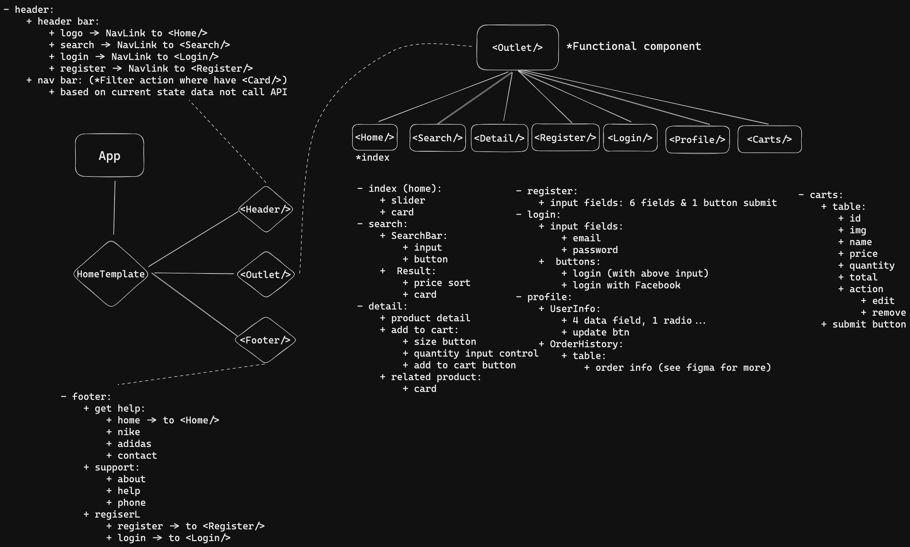

#CAPSTONE PROJECT 3
###  Project: The Shoe Shop
### Group 4:
##### - Phan Nhựt Quang
##### - Phạm Vũ Huy Hoàng
##### - Task: https://docs.google.com/spreadsheets/d/1u9w3pVOqzZn-c4po6TuSDXRPD5XiAw8SMl0RWbTTgmc/edit?usp=sharing
##### - Deploy: https://cyshoestore.surge.sh/


+ **Design**: Trương Tấn Khải
+ **API**: CyberSoft
+ - Testing features account:
  ```
  email: khaido@gmail.com
  password: 123
  ---
  or you can login with your own Facebook account
  ```
---
# I. App Introduce
- I. App Introduce
- II. App Overview:
- III. Detail
  - 1. Components
    - 1.1 HOC
    - 1.2 Stateless Components
        - \**The others components were assigned to Hoang Pham with unknown processing status.*
  - 2. Redux, axios and API
      - 1.3.1 Interceptor with axios
      - 1.3.2 Redux
  - 3. Form validation


# II. App Overview:
- Main component: Stateless component (Functional component)
 </img>
- Using: Bootstrap 4, Ant-design, redux/toolkit, Facebook login plugin,...
- API: provided by Cybersoft
- 5 main pages:
  - Home
  - Login
  - Register
  - Cart
  - Profile
****Profile page need authentication (user) to navigate in***
- Image source: Cybersoft
- SCSS, styling: Quang, Hoang
- Document: Quang
- Branches:
  - main
  - quang
  - hoang
* Each member has his/her own task with the App
- Detail features:
  - View product -> Select -> Add to cart -> Order
  - View profile -> Change info, password -> update
  - Register -> Input needed values -> Register
  - Login -> Input email, password or Login with Facebook ->...
- App's src folder tree:
```
src
├── assets
│   ├── css
│   │   ├── main.css
│   │   └── main.css.map
│   ├── fonts
│   ├── img
│   │   ├── facebook-icon.png
│   │   ├── image 3.png
│   │   ├── image 4.png
│   │   ├── image 5.png
│   │   ├── image 6.png
│   │   ├── next-btn.png
│   │   └── prev-btn.png
│   └── scss
│       ├── base
│       │   ├── _reset.scss
│       │   └── _typo.scss
│       ├── components
│       │   ├── _button.scss
│       │   ├── _navbar.scss
│       │   ├── _productCard.scss
│       │   └── _slider.scss
│       ├── helpers
│       │   ├── _mixin.scss
│       │   └── _variables.scss
│       ├── layout
│       │   ├── _footer.scss
│       │   ├── _header.scss
│       │   └── _productFeature.scss
│       ├── main.scss
│       └── pages
│           ├── _cart.scss
│           ├── _detail.scss
│           ├── _login.scss
│           ├── _profile.scss
│           ├── _register.scss
│           ├── _search.scss
│           └── _shoescard.scss
├── components
│   ├── HOC
│   │   ├── Modal
│   │   │   └── Modal.jsx
│   │   └── PasswordForm
│   │       └── ChangePass.jsx
│   ├── LoginFacebook
│   │   └── LoginFacebook.jsx
│   ├── ProductItem
│   │   └── ProductItem.jsx
│   └── shoesCard
│       └── ShoesCard.jsx
├── hooks
│   └── useFetch.jsx
├── index.js
├── pages
│   ├── Carts.jsx
│   ├── Detail.jsx
│   ├── Home.jsx
│   ├── Login.jsx
│   ├── Profile.jsx
│   ├── Register.jsx
│   └── Search.jsx
├── redux
│   ├── configStore.jsx
│   └── reducer
│       ├── modalReducer.jsx
│       ├── productReducer.jsx
│       └── userReducer.jsx
├── templates
│   └── HomeTemplates
│       └── Template.jsx
└── utils
    ├── config.jsx
    └── ultils.jsx
```
- More detail in the next section
****
# III. Detail
## 1. Components
### 1.1 HOC
**- Modal.jsx**

  - This component will defaultly invisible in the app. It will be only visible when user trigger at some action (change password action,...) .- Modal.jsx will receive a component from Redux to display expected content.
  - In fact, the developement of the app currently is not so widely to use this. But in the future, it is more useful to re-use it to display further information.
###  1.2 Stateless Components

**- Template.jsx**
  - Template.jsx is the master layout of all pages
  - It contains header and footer of the app
  - Header: 
      - Nav-link
      - Logo
      - Cart
    - Footer:
      - Back links

**- Home.jsx**
- This component contains:
  - Carousel (Ant-Design)
  - Product list (From API, render from Redux)
  - Pagination (Ant-Design):
    - Config:
      - 6 items on load
  - Items: render from card of `ShoesCard.jsx` component

**-Register.jsx**
  - This component contains:
    - Register form:
      - email: string
      - password: string
      - confirmPassword: string
      - name: string
      - gender: boolean
      - phone: string/ number (API auto convert) *Tested
    - Get input and validation by: `Formik` and `Yup` library
    - Each input field has its own specific schemma which is suitable to the expected data.
    - Check the component for more detail and how it work
    
**- Login.jsx**
  - This componet contains:
    - Login form:
      - email: string
      - password: string
    - Button:
      - Login -> do login action
      - Facebook login button -> do Facebook login action (**Supported by lib*)
    - Get input and validation by: `Formik` and `Yup` library
**- Profile.jsx**
  - This contains:
    - To navigate to this page, user must login first to get token,
    - User information field filled by calling from API (must be with token).
    - Can update all information and password via this page.
    - Using `formik` and `yup` for getting data and validating.
    - Import `Favorite.jsx` to render Favorite item.
    - Import `OrderHistoryTable.jsx` to render order history.
    - `OrderHistoryTable.jsx` and `Favorite.jsx`
      - These two .jsx are separated function beacause in the previous version, they take too much lines in the `Profile.jsx`
      - **`OrderHistoryTable.jsx`** receives 3 params to work as expected.
        ```Javascript
        OrderHistoryTable = (ordersHistory, minIndex, maxIndex)=>{
          ...
          //-> return the table
        }
        // orderHistory: []
        // minIndex: number -> pagination config
        // maxIndex: number -> pagination config
        ```
      - **`Favorite.jsx`**  receives only 1 instead.
        ```Javascript
        Favorite (data) =>{
          ...
          //-> return <ShoesCard/> from ShoesCard.jsx component
          }
          //data: []
        ```
**- ShoesCard.jsx**
  - Card component structured from Bootsrap 4's styling
  - Contains:
    - Product image
    - Button `Buy now` -> Navigate to `Detail.jsx` with among product
    - Price tag
    - Like button (Font-awesome 4)
      - There are two options to render this icon
        - Gray heart (non-like) -> click -> like -> Red heart (liked).
        - Red heart (liked) -> click -> unlike -> Red heart (non-like).
        - To decide which one to rener, the app automatically calling from API (with Token) to get user's liked products. From that, when rendering the card, it will check whether that current item is liked or not to render the right one.
##### **The others components were assigned to Hoang Pham with unknown processing status.*
## 2. Redux, axios and API
#### 1.3.1 Interceptor with axios
  - `config.jsx`
      - Storing saving, load storage, cookie function
      - config request:
        - Headers:
          - Authorization:...(Bearer)
          -...
      - Use `history` lib to navigate after doing some actions.
#### 1.3.2 Redux
```
redux
├── configStore.jsx
└── reducer
    ├── modalReducer.jsx
    ├── productReducer.jsx
    └── userReducer.jsx
```
- `configStore.jsx` 
  - set up store
  - import other reducer
- `userReducer.jsx` (quang)
  - Reducer type: slice
  - Name: userReducer
  - Reducer actions:
    - loginAction -> Do action login, get userInfo from local,...
    - getProfileAction -> Get profile to fill in `Profile.jsx`
    - updateProfileAction -> Do update action in `Profile.jsx`
    - getFavItemAction -> Get favorite items to do further actions
  - Async action: (API)
    - loginApi -> get result -> loginAction -> dispatch 
    - getProfileApi -> get result -> getProfileAction -> dispatch
    - updateProfileApi -> get result -> statusCode === 200 -> getProfileAction -> dispatch
    - getFavApi -> getFavItemAction -> dispatch
- `productReducer.jsx` (hoang)
  - Reducer type: slice
  - Name: productReducer
  - Reducer actions:
    - getProductAction
    - getProductDetailAction
    - addGioHangActioj
    - deleteItemAction
    - addItemAction
    - getAllProductByCategoryAction
  - Async actions:
    - getProductByIdApi -> result -> getProductDetailAction -> dispatch
    - getAllProductByCateGory -> result -> dispatch
    - getAllProductByCategoryAction -> dispatch
## 3. Form validation
  - Register.jsx
    - Using `Formik` to get data and validate with `yup`
    - The main purpose is to let the user post the data with the correct type of input fields.
      - Register user object modal:
        
        ```
        {
          email: string
          password: string
          name: string
          gender:boolean
          phone: string
        }
        ```
      - Validation
        ```
        email: must have @ and "."
        password: 8-16 chars, at least one Uppercase, special characters
        name: must be A-Za-z, no number, no special chars
        gender: boolean (accepted string, api auto convert)
        phone: string with only number
        *All are required*
        ```
      - Default pass register case:
        ```
        email: harrykane@gmail.com
        password: 123994@Kane
        name: Harry Kane
        gender: true
        phone: 2912039943
        ```
